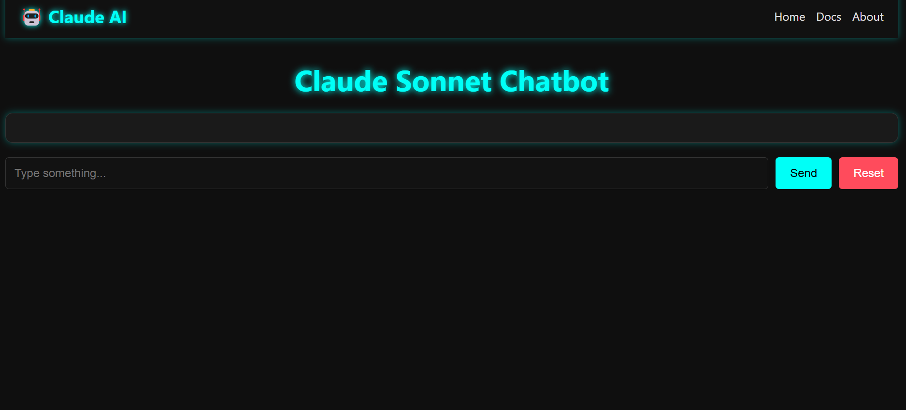

#add image link


 CLAUDE-UI
 A simple web UI for Claude API
 This is a simple web UI for Claude API. It is built using Flask and React. It allows you to interact with the Claude API in a user-friendly way. It is designed to be easy to use and customize. You can easily add new features and modify the existing ones.


# USER GUIDE
 AWS CLI
 To use this project, you need to have AWS CLI installed and configured. You can install AWS CLI using the following command:
 ```bash
 pip install awscli
 ```
 After installing AWS CLI, you need to configure it with your AWS credentials. You can do this by running the following command:
 ```bash
 aws configure
 ```
 This will prompt you to enter your AWS Access Key ID, Secret Access Key, region, and output format. You can leave the output format as default (json). Once you have configured AWS CLI, you can use it to interact with AWS services from the command line. You can also use it to run this project.
